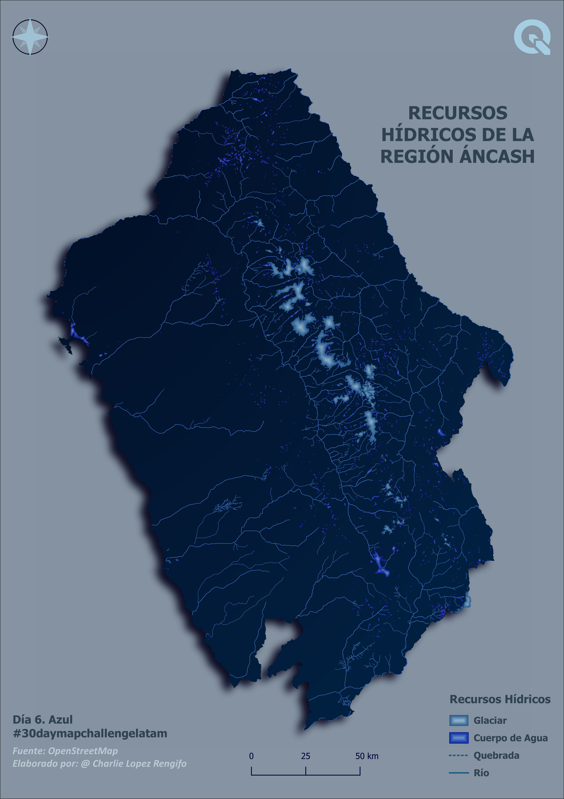
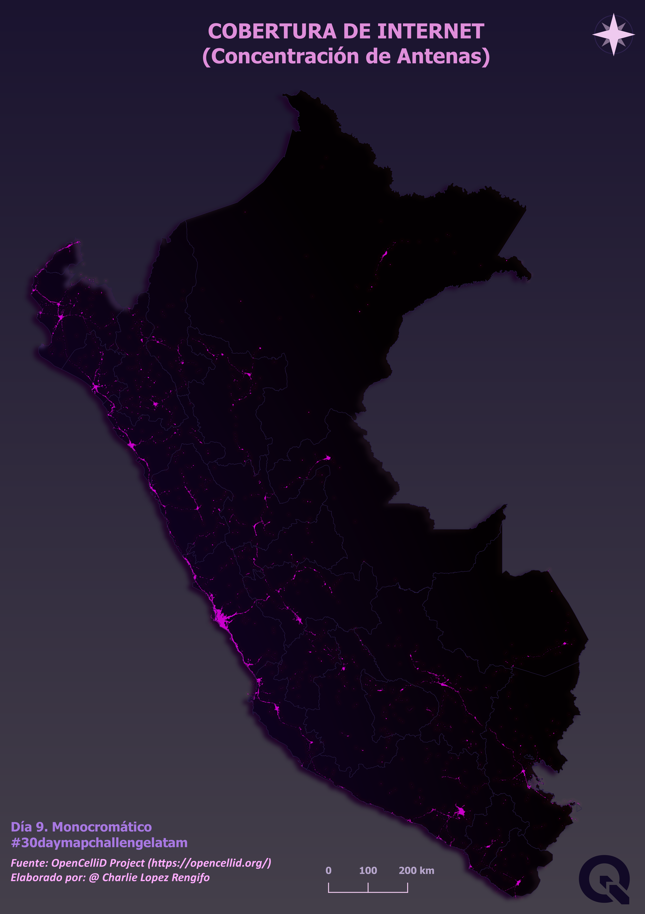

# #30DayMapChallengeLatam

## Día 1. Puntos

## Día 2. Líneas

## Día 3. Polígonos

## Día 4. Hexágonos

## Día 5. OpenStreetMap

## Día 6. Azul

## Día 7. Verde

## Día 8. Rojo

## Día 9. Monocromático

